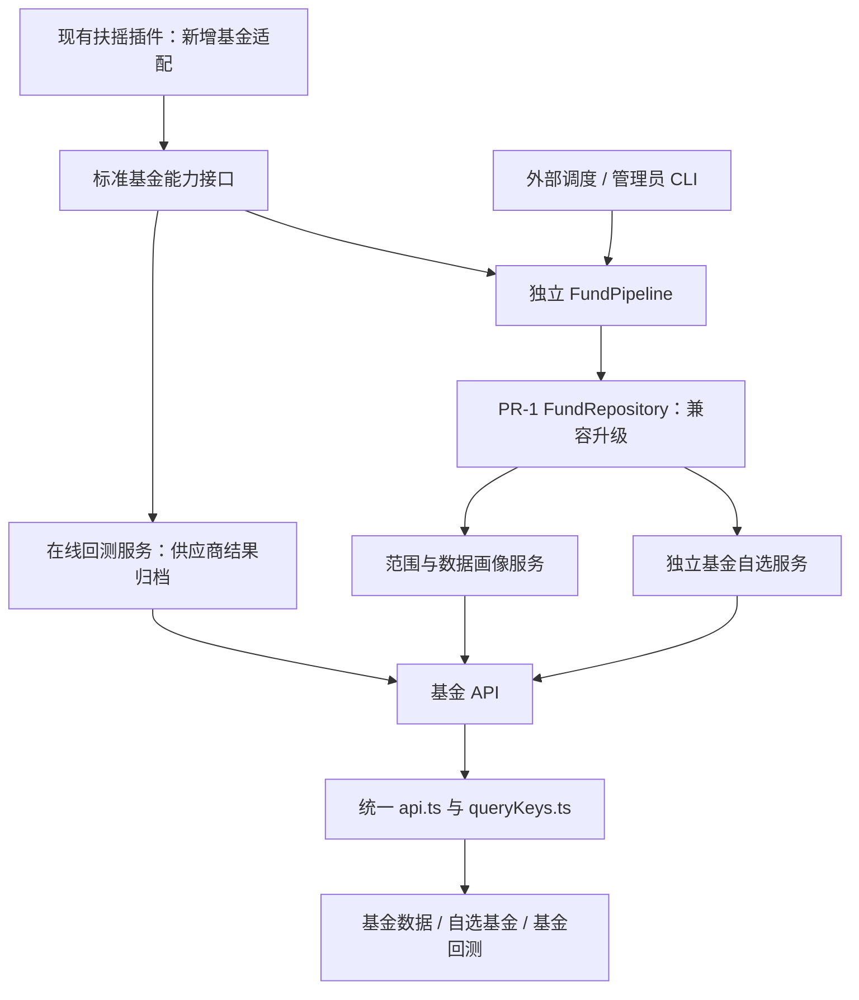

# 场外基金板块扩展设计（扶摇数据源版）

> 状态：设计提案，尚未实施。PR-1 的基金契约和快照仓库已经存在；此前 PR-2 已撤销，本设计不恢复其实现。
>
> 核对日期：2026-09-19；代码基线：`5d161ab092b39df10be36307c837cf5d36f8bebe`，分支 `feat/off-exchange-fund`。
>
> 遵循 [贡献规范](../CONTRIBUTING.md)、[二开规范](secondary-development.md)，参考 [因子系统设计](factor-system-design.md) 的现状、契约、接口、缓存、验收与分期结构。下文未标记“现状”的接口、类型和文件均为拟议设计，不代表当前可用。

## 1. 设计结论

以现有扶摇 Python 插件为首个真实适配对象，在已完成 PR-1 的基础上建设独立基金业务域，而不是新增另一套股票资产类型。

- 保留“基金数据”“自选基金”“基金回测”三个独立菜单及页面。
- 基金目录、净值、画像、自选和任务均不进入股票仓库、股票自选和 `daily_pipeline`。
- 扶摇插件复用现有密钥与 HTTP 基础设施；业务层只依赖标准基金契约。
- 先修正 PR-1 与真实来源不匹配的强制字段，再接入生产数据；不编造发行人、份额类别、历史有效期和披露时间。
- 首期回测建议接入“扶摇在线回测”，明确标注数据源计算及未核验的成交规则；本地逐笔申赎回测列为后续独立里程碑。两者不混同，也不接入股票回测。
- 首期生产范围为扶摇目录明确提供的场外公募。分类模型保留定开、封闭、货币、QDII、私募等差异；没有来源证据的类型保持未知，没有能力的操作明确禁用。

最后一项回测路径是本次**建议变更**：此前方案要求首期自行实现合同级本地引擎；当前文档不足以支持该承诺。若仍要求首期本地回测，应先补足第 10 节的数据条件，不能将在线回测作为已经完成本地引擎的证明。

### 1.1 范围解释

场外表示份额的办理渠道，不表示投资组合不持有交易所证券。ETF 场内行情、LOF 场内交易、REITs 场内交易不能因名称含“基金”而进入场外净值业务。双渠道产品必须有明确的场外份额身份；不得把两个渠道代码自动合并。

“数据范围新增基金”和“基金画像”在独立的基金数据页交付。原数据页当前没有可用的基金局部插槽；若要求直接嵌入原页面，属于另行批准的局部 L3，而不是本设计默认范围。

## 2. 先理解：当前实际能力

| 领域 | 当前代码证据 | 设计影响 |
| --- | --- | --- |
| 基金契约 | `backend/app/funds/contracts.py` | 已有目录、净值、事件、条款、覆盖五类模型；不是完整基金业务 |
| 基金存储 | `backend/app/funds/repository.py` | 五类 Parquet、完整快照、manifest、UUID generation、原子指针；不是增量同步引擎 |
| 仓库测试 | `backend/tests/test_fund_repository.py` | 覆盖版本、原子发布、修订、分类；需扩展真实来源缺字段与旧版本兼容 |
| 扶摇接入 | `backend/app/plugins/fuyao/{client,provider}.py`、`plugin.yaml` | 已有股票能力和密钥读取，没有基金接口；不能声称配置 Key 即已接入基金 |
| 插件加载 | `backend/app/data_providers/custom/loader.py` | Python entry 可扩展；实际能力检测读取实例 `config.datasets`，清单必须同步 |
| 普通 YAML 源 | `backend/app/data_providers/custom/config.py` | 现有允许数据集不含基金；首期不改为通用基金映射器 |
| 后端扩展 | `backend/app/extensions/{contracts,registry,loader}.py` | 支持独立路由和 startup；上下文只有数据目录与只读股票仓库，没有 shutdown |
| 前端扩展 | `frontend/src/extensions/{bootstrap,registry,types}.ts` | 支持静态绝对路径和导航；没有基金数据页或回测页内部插槽 |
| 公共客户端 | `frontend/src/lib/{api,queryKeys}.ts` | 请求函数未公开为二开客户端；需最小追加方法、类型和集中查询键 |
| 菜单 | `frontend/src/components/Layout.tsx`、`pages/settings/MenuSettings.tsx` | 扩展项追加在内置/分析项之后；首期不承诺紧邻“自选”或进入原菜单排序设置 |
| 核心任务 | `backend/app/services/pipeline_jobs.py`、`api/pipeline.py` | JobStore 构造会回收磁盘活跃任务，不能在基金 API 与 CLI 两个进程各建实例共用 |
| 自选 | `backend/app/services/watchlist.py`、`frontend/src/pages/Watchlist.tsx` | 可参考分组、置顶、批量交互；不能复制报价链路或写原股票自选文件 |
| 回测 | `backend/app/backtest/`、`api/backtest.py` | 当前为证券 K 线与成交模型，不适用于基金申购确认和赎回到账 |
| 认证 | `backend/app/services/auth.py` | 单密码自托管，不提供多用户私募持有人权限隔离 |

现有三个前端插槽只有 `layout.navigation.extra`、`stock-preview.footer`、`watchlist.toolbar`。本方案使用完整页面注册，不假设未实现的插槽或成本模型接口。

### 2.1 PR-1 不可直接套用的约束

当前目录强制 `issuer_id/share_class/valid_from`；净值必须落在目录有效区间；净值只有单位和累计净值，没有复权净值；事件、条款要求精确 `published_at`。仓库精确核对 schema，只读版本 1，公开快照拒绝私募和未知募集类型，并限制单快照单数据源。

这些约束保护了数据质量，但真实接口缺字段时会阻止接入。不能用基金名称尾字充当份额事实，也不能用首次同步日期充当成立日期或历史有效起点。

## 3. 先理解：扶摇接口能提供什么

以下均依据公开文档，不是当前账号权限或在线生产调用验证。供应商文档的示例值不是完整枚举，也不是本项目的数据承诺。

| 数据能力 | 文档及端点 | 接入结论 |
| --- | --- | --- |
| 场外公募目录 | [标的列表](https://fuyao.aicubes.cn/docs/api-reference/ticker-list/)；`GET /api/meta/tickers/list` | `asset_type=fund-otc`；limit/offset 分页；保留完整 thscode |
| 基本资料 | [基金基本资料](https://fuyao.aicubes.cn/docs/api-reference/fund-profile/)；`/api/fund/profile/detail` | 基金公司、经理、规模、成立时间、交易规则与费率展示；可空字段不强填 |
| 历史净值 | [业绩与回撤](https://fuyao.aicubes.cn/docs/api-reference/fund-performance/)；`/api/fund/performance/nav` | 单位净值与复权净值分开；range 为预定义窗口，不支持文档未列出的日期分页 |
| 业绩摘要 | 同上；`/returns`、`/drawdowns` | 作为供应商计算的指标展示，不能冒充本地独立复算 |
| 分红 | [分红记录](https://fuyao.aicubes.cn/docs/api-reference/fund-corporate-actions/)；`/api/fund/corporate-actions/dividends` | 每十份金额需转换；公告日期不等于精确发布时间；不代表全部公司事件 |
| 在线回测 | [基金在线回测](https://fuyao.aicubes.cn/docs/api-reference/fund-backtest/)；`/api/fund/backtest/result`、`/indicators` | 可做独立供应商回测；不能证明本地申赎规则正确 |
| 通用指标 | [基金通用指标](https://fuyao.aicubes.cn/docs/api-reference/fund-indicators/)；`/api/fund/indicators/line`、`/table` | 后续扩展；必须先验证具体指标 ID、单位和空值对齐，不能凭接口存在假设任意数据可取 |
| 基金行情 | [基金总览](https://fuyao.aicubes.cn/docs/api-reference/funds/)中的行情边界 | 当前行情面向 ETF，不拿来作为场外基金实时价格 |

### 3.1 对方案有决定性的边界

1. 目录的 `fund-otc` 明确是场外公募；它不证明私募覆盖，也不直接给出完整的投资分类和运作方式。基金币种字段目前统一返回 CNY，不能据此认证境外币种份额。
2. 净值不传 range 只返回至多最新一条；已列窗口最长为 `fyear`。没有任意 start/end 或游标，因此首次同步只能承诺“供应商窗口内实际返回覆盖”，不能承诺成立以来全历史。
3. `adj_nav` 是复权净值，不是 `accumulated_nav`。基本资料里的单个 `unit_nav` 缺对应净值日，不可当历史净值入库。
4. `data.timestamp` 可能是数据时间或组装时间；必须与获取时间、估值日期、公告日期分别保存，不能据此还原逐条历史可获得时间。
5. 在线回测返回对象，指标目录返回数组；不能统一按 `data.item` 读取。当前客户端 `payload.get("data") or {}` 会把空数组变成对象，基金路径必须修正这个问题。
6. 通用百分数约定不适用于所有动态指标与在线回测字段。基金适配器使用逐字段单位表，禁止按数值大小猜测百分比。

## 4. 总体架构及最小接入点

上述所有基金路径与原 `daily_pipeline → KlineRepository → enriched → 股票策略/回测` 分离。复用原子文件工具、认证、HTTP 请求封装、组件和扩展注册，不继承或复制原系统的大型服务。

| 模块 | 拟议落点 | 责任 |
| --- | --- | --- |
| 供应商标准化 | `backend/app/plugins/fuyao/funds.py` | 扶摇字段、单位、错误、响应形状适配 |
| 插件接线 | 现有 fuyao client/provider/manifest | 复用密钥、HTTP；公开基金方法与能力，不更改股票返回类型 |
| 领域与存储 | 现有 `app/funds/contracts.py`、`repository.py` | v1/v2 兼容、标准记录、快照 |
| 能力端口 | 新 `app/funds/provider.py` | 从 custom loader 获取 Provider，验证真实方法及能力 |
| 同步执行 | 新 `app/funds/{pipeline,run_store,cli}.py` | 单写者、同步计划、恢复、原子发布 |
| 服务与 API | 新 `app/funds/{profile,watchlist,backtest,api}.py` | 服务编排、只读画像、独立自选、回测记录、薄 API |
| 注册 | 新 `backend/app/custom/funds.py` | 路由注册；startup 注入数据目录，不启动常驻线程 |
| 前端 | 新 `frontend/src/custom/funds/` | 注册三个静态路由与页面，详情以 query 参数或抽屉表示 |

不另建新的全局 Provider 注册器、HTTP 客户端框架、指标语言或任务调度平台。

## 5. 分类、能力与功能准入

### 5.1 分类维度

沿用 PR-1 的募集方式、运作方式、投资类别、净值频率、渠道五个轴，不把“私募”和“封闭式”作为互斥类型。新增分类证据来源和观测时间；未知不是开放式，也不是每日披露。

| 类型/情况 | 首期目录与画像 | 自选基金 | 在线回测 | 本地合同级回测 |
| --- | --- | --- | --- | --- |
| 明确场外公募、普通开放式 | 支持已获取数据 | 支持 | 经指标、频率与接口实测后启用 | 后续，需完整规则 |
| 定期开放 | 展示开放窗口是否有证据 | 支持 | 不声称遵守窗口；首期未验证则禁用 | 需窗口历史与暂停规则 |
| 场外封闭式份额 | 必须先确认场外身份 | 支持目录内产品 | 首期未验证则禁用 | 需封闭期、到期/退出规则 |
| 货币基金 | 可展示；缺适用收益数据明确说明 | 支持 | 首期不默认放行 | 不能用恒定净值模拟真实收益 |
| QDII / FOF | 保留实际净值日、币种证据、披露延迟 | 支持 | 经逐类验证才放行 | 需估值、跨市场日历等证据 |
| 分类未知的公募 | 支持并显示“分类待核实” | 支持 | 可保留供应商研究入口，默认禁用规则可信声明 | 禁用 |
| 私募或募集方式未知 | 不进入当前公开快照 | 首期不开放 | 不支持 | 另立授权和数据隔离设计 |
| 只有场内交易身份 | 拒绝进入本域 | 不支持 | 不支持 | 不支持 |

在线回测启用采用已验证产品/类别白名单，不因“供应商接口可返回结果”就宣称模型适用于全部产品。基金公司和名称可展示，但不自动推断法律发行主体、份额等级或申赎规则。

### 5.2 能力边界

拟定义 `fund_catalog`、`fund_nav`、`fund_profile`、`fund_dividends`、`fund_online_backtest`。后两者不冒充完整 `fund_events` 或历史 `fund_terms`。

首期基金域配置只选择一个明确的 Provider，不做逐数据集自动跨源回退。使用现有 custom loader 的发现和 `provider_has_dataset`；清单、实例 datasets、方法一致才允许选用。

原全局能力矩阵仍是现有通用路由的权威；基金页面返回的是本扩展选定源的健康与能力检查结果，不复制一个全局路由矩阵，也不修改股票能力偏好。如未来要求进入设置页全局矩阵，必须按贡献规范同时改注册表、preferences、API 注入与矩阵测试，另列 L3。

“Key 已配置”不等于“基金有权限”。现有扶摇 probe 测股票端点，基金扩展必须独立验证相关端点并区分未配置、未验证、可用、拒绝、暂时失败。基金专用 Key 可通过既有环境配置接入；若设置页禁止保存此类 Key，再单独补最小检测方式，不扩大股票校验语义。

## 6. 数据契约与 PR-1 兼容修订

### 6.1 标识、精度与时间

- `fund_id = fuyao:<完整 thscode>`，例如 `fuyao:000001.OF`；保留 source_namespace 和 provider_code，不以裸六位代码跨源合并。
- `source_ref` 保持安全、不含路径分隔符的记录引用；URL、请求参数、request_id、响应哈希进入独立来源元数据，不把 URL 填进当前受限字段。
- 从 JSON 文本以 Decimal 解析基金金额/净值，API 以十进制字符串传输。不得先解析 float 再转换，超过现有精度时拒绝并报告，不隐式截断。
- 区分 nav_date、announcement_date、published_at、observed_at、ingested_at、provider_timestamp。日字段按接口业务日期映射；时间戳使用显式时区，不依赖服务器时区。
- 缺 published_at 保持空并标记 `time_quality=unknown/date_only`；只能展示，不用于本地历史信号。

### 6.2 v2 变更清单

| 模型 | 必要变化 | 兼容与安全约束 |
| --- | --- | --- |
| Catalog | issuer_id、share_class 可空；新增 management_company_id、observed_at、classification_evidence；valid_from 可空 | company_id 不直接等同 issuer_id；未知历史区间不等同从无限过去有效 |
| Nav | 新增可空 adjusted_nav、adjustment_basis、time_quality | accumulated_nav 保留原语义；扶摇没有累计净值证据时置空 |
| Catalog/Nav 关联 | 目录存在但历史有效期未知时允许保存历史净值，标记 identity_history_unverified | 只解除存储阻断，不授予点时回测资格；已知区间仍严格校验 |
| Coverage | 增加 requested_window、actual_start/end、reason、checked_at、evidence_level | 实际返回范围不等于完整性证明；不用股票交易日生成基金缺口结论 |
| Profile 附属快照 | 保存资料、当前费率/交易规则展示、来源时间、payload_hash | 不是历史可执行 FundTerm，不写虚假的 valid_from/published_at |
| Dividend 附属快照 | 保存每十份原值、税前/税后、进度、日期、可用性 | 缺精确时间/必要日期时不强转严格 FundEvent；以后有证据才能提升 |
| Event/Term | 保留现有严格语义 | 当前扶摇接口不足以证明完整事件与历史条款，coverage 标为 partial/unavailable |

附属快照采用版本化类型与明确 schema，和核心数据在同一代次发布；不是任意 JSON 透传给前端。原始脱敏响应只用于审计，设大小与保留上限；不得保存密钥。

### 6.3 迁移流程

当前 reader 精确匹配 schema，简单添加可空列也会破坏旧 reader，必须显式升级：

1. reader 支持 v1/v2，按 manifest 版本选择 schema；v1 在内存补缺省字段，保留原始校验和与文件不变。
2. 新 writer 写 v2 的新 UUID generation，完成全量校验后切 current 指针；禁止原地改旧 Parquet。
3. 迁移记录源 generation 和目标版本；重复迁移同一来源得到等价内容，允许新的 generation，但不得重复叠加业务记录。
4. 高于 reader 支持的版本拒读/拒写，不能“尽量解析”后覆盖。
5. 降级先停写，明确选择保留的 v1 指针或停用扩展；旧程序不能读取 v2 指针。不得以删除 data/funds 回滚。
6. 旧回测和画像引用固定 generation，不因指针变化偷偷替换历史数据。

## 7. Provider 与独立同步

### 7.1 拟议标准能力方法

这些方法在当前代码中尚不存在，名称是实施契约，不是可直接调用的 API：

| 方法 | 标准输入 | 标准输出 |
| --- | --- | --- |
| list_fund_catalog | limit、offset | CatalogPage：items、has_more、来源元数据 |
| get_fund_nav | fund_id、window 枚举 | NavBatch：records、实际覆盖、限制说明 |
| get_fund_profile | fund_id | 可空资料字段及来源证据 |
| get_fund_dividends | fund_id | 标准分红展示记录、coverage |
| get_fund_backtest_indicators | 无业务参数 | 已适配指标描述及未知类型提示 |
| run_fund_online_backtest | 已验证条件与频率、次数、金额 | 标准归档结果、原始指标单位状态、来源信息 |

FuyaoProvider 只做薄转发。client 增加基金专用响应解析入口，复用 HTTP 配置与认证，但不全局改变股票 JSON float 行为。严格检查 code 和 data 形状，保留空数组、request_id 和业务错误；现有股票方法回归必须通过。

Provider 由 custom loader 获取而非仅支持 TickFlow 的另一路 registry。loader 重载会关闭旧实例：同步 CLI 独立进程加载实例并在 finally 关闭；在线请求遇源重载则终止本次请求并提示重试，不持有已关闭实例长期缓存。

### 7.2 范围配置

独立 `data/funds/config.json`，含 config_version、provider_id、enabled、catalog_scope、nav_scope、nav_window、datasets、并发/重试限额。

- 目录：同步全部 fund-otc，供本地搜索；不逐只请求详情才能建目录。
- 净值：默认“自选基金 + 显式选择代码”；全市场须预估请求数并显式确认。
- 类型筛选：只匹配有证据的分类；未知单列，不能悄悄按基金名称划分。
- 初次净值：显式选择受支持窗口；后续刷新同窗或短窗，并周期重抓较长窗发现历史修订。抓不到窗口外数据时保留旧数据且显示未重新核验。
- 源切换：首期有基金数据时禁止直接覆盖换源，须独立新命名空间/受控重建设计；单快照单源约束不被暗中解除。
- 配置没有 Key 副本；复用现有 secrets_store / FUYAO_API_KEY。

### 7.3 任务所有权：首期 CLI 单写者

为避免新增生命周期接口，首期采用**独立 CLI 执行同步，Web 读取状态**。网页提供计划预览、状态和管理员运行命令，不显示已经实现的一键后台启动。自动化由部署环境外部调度，文档不自动安装系统任务。

CLI 获取 data/funds 下的跨进程 OS 写锁；持锁覆盖一次完整执行，另一个执行立即返回 busy。API 不构造核心 JobStore、不回收活跃记录、不写同步快照。进程崩溃由 OS 释放锁；只有下一持锁执行者可以把上次未完成任务标记 interrupted。

采用仓库现有跨平台锁模式并单独测试 Windows/macOS/Linux；不能仅用 PID 或时间过期判断抢占。首期只支持本地文件系统，不承诺 NFS 分布式锁。网络调用设超时、总运行期限、最大重试，CLI 退出/中断在 finally 关闭源并释放锁。

状态：queued → running → succeeded / failed / cancelled / interrupted。取消先记录请求，worker 在批次与发布前检查；发布提交点之后的取消返回“已完成”，不能把已发布代次标记为未发布。

若后续必须网页一键启动长期任务，另立局部 L3 生命周期设计（关闭钩子、执行器收敛、资源释放、重载兼容）；不得把无 shutdown 的 startup 强行变成常驻线程框架。

### 7.4 同步步骤与恢复

1. 校验配置、权限、实际方法、预算，固定 config_hash 与目标 fund_id 集合。
2. 获取锁，创建 run_id，读取旧 generation，分页拉目录；分页以实际条数判断终止。
3. 按标的与数据集拉取，标准化、校验、写暂存；checkpoint 包含源、配置哈希、标的、数据集、窗口、已完成页。
4. 只有目录有 offset 分页；NAV 不伪造 date cursor。配置或适配器版本变化不能盲用旧断点。
5. 与旧快照合并；同键同内容不增加 revision，不同内容增加 revision并保留旧版。短窗未返回的数据不等于删除。
6. 构建全量候选快照与 coverage，校验哈希/schema/关联，再 publish 原子切换指针。
7. 原子保存终态及新 generation；画像只读取已发布代次。

默认一次运行原子成功或失败，不发布半个批次。局部错误保留旧代和失败清单，管理员缩小范围后重新运行；成功但空数据与请求失败严格区分。空目录不得替换已有效目录。旧快照内容保留时 coverage 必须显示其核验时间，不能标成刚完成刷新。

请求策略首期保守串行，受配置约束的有界并发留到有配额证据后启用。只对暂时性网络/限流/服务故障有限重试；鉴权、参数、资产不支持不重试，不静默换源。不声称未获文档证明的 QPS 或最大历史年限。

## 8. 基金数据页与画像

静态路由 `/funds/data`；内部包含“数据范围、数据画像、同步记录”三个标签。

画像由 generation 固定的服务汇总，返回目录总数、选定范围数、已同步净值数、各类未知比例、实际净值起止、最后核验时间、来源、schema、异常原因。覆盖分母必须标注：已选净值范围，不是默认整个基金目录。

不以 A 股交易日判断所有基金漏数。预期频率未知显示“无法判定完整性”；接口窗口受限显示“范围受限”；只有充分证据才能标 complete。最近净值为旧日期不是零涨跌，也不能自动认定异常停牌。

首期单位净值和复权净值分线展示；累计净值缺失不补线。当前费率与历史规则分开，明确“当前资料，不适用于自动历史成交”。供应商业绩与本地净值变化分别命名并携带计算来源，不用简单单位净值差当含分红总收益。

## 9. 自选基金

静态路由 `/funds/watchlist`，参考原自选的交互，但复用共享组件而不是复制 Watchlist.tsx。

| 操作 | 设计 |
| --- | --- |
| 搜索/添加 | 查询本地完整目录；按完整代码、裸代码、名称查找；同名/不同份额显示完整代码与来源供确认 |
| 列表 | 名称、代码、已知类型、最新单位净值/日期、覆盖状态、分组、备注、置顶 |
| 详情 | 净值曲线、基本资料、分红、费率说明、数据缺口；按需请求，不逐行加载完整资料 |
| 分组与排序 | 多组、置顶、移组、重命名、删除组；删组保留基金并转未分组 |
| 批量 | 文本/CSV 导入预览，展示重复、未知、歧义；确认后写入；导出防公式注入 |
| 刷新 | 刷新本地已发布数据；无后台执行器时明确指引同步，不能用按钮文案暗示实时行情 |
| 移除/清空 | 确认后仅改自选文件，不删除净值和回测 |
| 不适用功能 | 盘口、分钟线、股票交易信号不平移；图片识别导入不列首期 |

自选保存为独立版本化 `data/funds/user/watchlist.json`，带 revision；写入使用独立短时文件锁、原子替换与 expected_revision 冲突检查。锁内不请求网络。同步读取自选时固定其 revision，避免运行中范围漂移。

目录下架、无净值或源暂不可用仍保留用户条目；显示失效原因。搜索不要求股票自选仓库、证券代码格式或 realtime 能力。

## 10. 独立基金回测

### 10.1 首期：数据源在线回测

静态路由 `/funds/backtest`；页头固定标注“扶摇在线回测（研究用途；申赎、费用与点时规则未由本系统验证）”。不输出 verified=true，不与股票回测绩效排名混用。

- 表单从指标目录生成，只开放已实现类型、受支持操作符和已验证阈值单位；未知 type/value_kind 不猜测。
- 条件对象/数组经过后端白名单、深度、长度、数值范围校验，再由 HTTP 库编码；不允许 eval 或任意表达式执行。
- 文档只给频率字符串及 WEEKLY 示例，完整枚举未给出。首期仅启用实际验证通过的频率，不伪造日/月频列表。
- 文档请求没有 start/end，不提供会误导用户的自选回测区间控件；结果显示上游实际返回区间。
- 金额、次数为正且有服务端资源上限；源调用设超时与有界并发。首期采用有超时的请求，不偷偷启动不可管理的长期后台任务。
- 指标、曲线、交易行按已确认结构适配；单位不明显示原值与“单位未确认”，未确认曲线不画百分比轴。
- 返回日期/金额/份额只是供应商交易明细，不添加虚假的申请、确认、到账时间或费用字段。

结果归档包含 run_id、mode=provider_online、provider_id、完整代码、规范化输入、输入哈希、指标元数据哈希、适配器版本、请求时间、request_id、实际区间、原响应哈希、标准结果、限制说明。敏感请求头不落盘。

相同输入不承诺供应商可重复计算出相同结果；默认返回已归档记录，用户明确重跑生成新记录。在线结果不冒称来自本地 generation；可记录运行时本地目录代次用于身份展示，但计算来源仍是供应商。

### 10.2 后续：本地合同级申赎回测

必须独立评审，不将本地仓库“已有净值”当成可实现条件。启用某类产品至少需要：

- 历史净值的真实可获得时间及修订版本。
- 历史申赎开放窗口、截止时间、确认与到账规则。
- 费率、持有期阶梯、最小金额/份额和分红选择。
- 完整的分红、拆分、转换、暂停、清算等相关事件。
- 适合产品的估值日历、币种与必要收益序列。

后续引擎依次处理信号可见性、申请资格、确认价格、现金/份额过账与到账可用性。不能假定统一 T+1、统一 15:00、恒定费率，也不能同时使用复权收益和重复现金分红。必须以逐笔黄金账本及未来数据扰动测试验收。

缺任一必需信息返回资格缺口，不自动切换成“看似真实”的净值收益回测。私募的授权、业绩报酬和持有人隔离另立方案。

## 11. API、缓存与错误契约

以下均为拟议 `/api/funds` 路由，由后端扩展注册，沿用主应用认证。

| 路由 | 用途与关键字段 |
| --- | --- |
| GET /capabilities | 选定源、声明能力、验证状态、原因、checked_at |
| GET/PUT /config | 版本化范围配置；乐观并发；不返回密钥 |
| GET /catalog | q、分类、分页；返回 generation 与身份/证据 |
| GET /profile、/nav、/dividends | fund_id、可选固定 generation；来源与缺口，不在 API 层直连源 |
| GET /data-profile | 同代次汇总，明确分母 |
| GET /runs、/runs/{id} | 只读同步状态与脱敏错误 |
| POST /runs/{id}/cancel | 原子取消请求，CLI 在安全点响应 |
| GET/PUT /watchlist | revision 与条目；冲突 409 |
| GET /backtest/indicators | 服务层能力检查与缓存 |
| POST /backtests | 有界在线计算并归档；不是证券下单 |
| GET /backtests、/backtests/{id} | 已归档结果与计算限制 |

读取详情/净值只访问已同步仓库；需要最新资料由同步任务更新。在线回测和指标目录例外走专属服务 → Provider，不绕过服务层。

统一错误语义：400 输入、401 本应用未认证、404 本地不存在、409 配置/版本/锁冲突、422 产品或数据不支持、502 上游失败、503 能力未就绪、504 超时。上游鉴权失败不能伪装成本应用登录失效；带可读 reason_code、retryable，不返回密钥或完整内部路径。

缓存规则：

- 仓库读取先固定 current generation；同一响应禁止混两代。服务汇总缓存以 generation + scope_hash 为键。
- 基金查询键集中追加到 queryKeys.ts；包括源、fund_id、窗口/范围、generation 或 revision。
- 基金缓存不加入股票 realtime SSE 前缀；页面活跃时适度轮询同步状态，发现 generation 改变才失效基金数据。
- 自选变更只失效基金自选/相关范围；不清股票缓存。设置源/权限变化清相关基金资料和指标缓存。
- 在线结果不可变；元数据缓存按源和适配器版本隔离，有 TTL。失败不得缓存成空成功。
- 列表一次批量从本地取最新净值；禁止每张卡片独立请求供应商。

## 12. 接入级别与风险

L1/L2/L3 表示扩展与升级冲突风险，不表示金融错误严重程度。新领域实现通过扩展接入，但修改已有代码的部分不得笼统标为“零 L3”。

| 改动 | 级别 | 主要风险 / 门槛 |
| --- | --- | --- |
| 范围配置、外部 CLI 调度配置 | L1 | 配置高版本拒写，默认不开启全市场拉取 |
| 独立页面、后端路由注册 | L2 | 路由冲突/加载失败仅禁用基金 |
| 新基金服务和独立 pipeline | L2 接入 | P1：并发/中断覆盖旧数据；单写者与故障注入验收 |
| 新扶摇基金适配模块 | L2 插件方式 | P1：单位/时间/身份映射；标准样本与真实脱敏响应验收 |
| 现有 fuyao client/provider/manifest 接线 | 局部直接源码改动，按 L3 复核 | 保持股票接口、空值和 JSON 解析行为，避免全局 Decimal 改造 |
| 已有 PR-1 契约/仓库升级 | 基金域局部源码改动，按 L3 兼容要求管理 | P1：旧 schema 不可读；v1/v2 和指针回滚测试 |
| api.ts、queryKeys.ts 追加 | 局部 L3 | 不改变已有 request 与证券键，构建/认证/缓存回归 |
| 在线回测语义不明 | L2 接入，业务 P1 | 标签、单位、实际区间、分类准入；不声称本地验证 |
| 私募与未知募集类型公开入库 | 首期禁用，业务 P0/P1 | 保留公开仓库拒绝与 API 负例 |
| 嵌入原数据页、全局矩阵、常驻任务、菜单排序 | 首期不做；通常局部 L3 | 真实需求确认后独立 PR，不借本项目顺手改造 |

首期不修改 main.py、router.tsx、Layout.tsx、股票引擎、daily_pipeline。允许必要的小范围源码接线，避免为“零 L3”复制 HTTP、整页 UI 或核心任务服务。

## 13. 分期实施与验收

为避免与已撤销 PR-2 混淆，新阶段使用 PR-2A 起编号；旧 PR-2 不视为完成项。

| 阶段 | 交付 | 依赖与验收 |
| --- | --- | --- |
| PR-1 已有 | 契约与原子快照基础 | 保留现有行为及测试，不重复实施 |
| PR-2A | 真实样本契约、v2 reader/writer、迁移 | 缺字段可保存但不伪造历史；旧代可读；高版本拒写 |
| PR-2B | 现有扶摇插件基金能力 | 清单/实例/方法一致；Decimal、数组/对象、业务错误、股票回归 |
| PR-2C | CLI 单写者 pipeline、配置与任务 | 锁、恢复、范围限制、修订合并、原子发布；不改股票任务 |
| PR-3 | 后端注册、基金数据页、画像与范围 | API/前端一致、空/错/未配置/无权限、窄屏、构建 |
| PR-4 | 自选基金完整常用操作 | 搜索歧义、并发冲突、导入预览、独立持久化与缓存 |
| PR-5 | 在线回测元数据、受限表单、结果归档 | 真实权限与固定样本、指标单位、频率、结构、超时；无虚构日期输入 |
| 后续独立立项 | 本地申赎引擎、类型扩大、更多画像指标 | 数据证据及逐类型黄金账本通过后才启用 |

PR-2B 可先做只读适配器测试，但生产写入必须依赖 PR-2A。PR-5 不依赖本地净值拥有全历史，却依赖目录身份、产品准入和回测接口验证。每个 PR 更新实际实现标记和 plugin-development/custom-data-source 对应契约，不提前修改用户说明为“已上线”。

### 13.1 测试矩阵

| 边界 | 必测情形 |
| --- | --- |
| 目录 | 完整代码、重复分页、空页、未知分类、公司非发行人、场内记录拒绝 |
| 净值 | 单位/复权/累计分离、缺精确发布时间、未传 range 仅最新、窗口受限、修订 |
| 金额与日期 | JSON Decimal、超精度、每十份转换、税前/税后、日期不冒充发布时间 |
| 仓库 | v1/v2、旧校验和、迁移重试、未知版本、缺历史身份、发布中断旧代可读 |
| 同步 | 两进程竞争、进程死亡、取消提交边界、配置变更拒复用断点、空目录保护 |
| 插件 | 未配 Key、基金无权限、空数组、对象响应、超时、loader 重载、股票能力回归 |
| 自选 | 同名多份额、无净值、下架、分组删除、revision 冲突、CSV 注入、股票文件不变 |
| 回测 | 动态类型未知、单位未知、条件越界、返回曲线变形、频率不支持、原结果不改写 |
| 前端 | 三静态路由、直接刷新、异常隔离、五态、窄屏、基金/股票查询键隔离 |
| 原系统 | 关闭扩展时股票同步、自选、回测和设置与基线行为一致 |

实施最低验证：基金定向 pytest、受影响扶摇/扩展/原子写测试、Ruff；前端变更执行 pnpm build 和页面联调；文件锁审查三平台失败路径。测试断言业务数据而非只检查 HTTP 200。真实 API 调用使用授权测试账号，固定脱敏 fixture，不在 CI 强制依赖外网或密钥。

## 14. 尚需验证的上线条件

以下不阻止本设计成文，但分别阻止相关能力宣称“可用”：

1. 当前 Key 的基金权限、限流、实际响应空值和字段类型。此次只阅读公开文档，没有调用需要 Key 的业务接口。
2. 分类、份额类别和身份历史的可靠补充来源。首期允许未知，不能自动猜测填满。
3. 在线回测完整频率枚举、指标类型/阈值单位及成交成本口径。未确认部分禁用或仅展示原值，不能自动归一成百分比。
4. 首期采用外部 CLI 执行，不提供网页一键后台同步；若此体验不满足需求，应先批准生命周期小改造。
5. 历史公告精确时间、完整事件和合同版本不足，本地合同级回测仍是未实现、未具备数据前提的后续目标。

## 15. 本次文档修订记录

本次重新核对了贡献/二开规范、PR-1 实现与测试、现有扶摇插件、扩展入口、任务所有权和前端接线；阅读扶摇基金总览及目录、资料、净值、分红、指标与在线回测文档。

本次仅更新设计，不实施迁移、不调用付费/鉴权业务 API、不恢复已撤销的 PR-2、不修改股票流程。以本次实际执行的文档差异与空白检查作为验证；历史 PR-1 测试记录不当作本次重新执行的结果。
