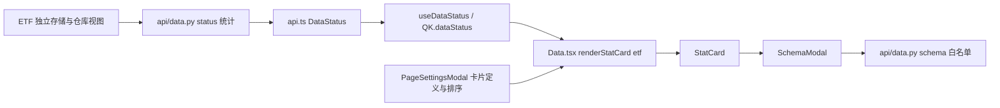
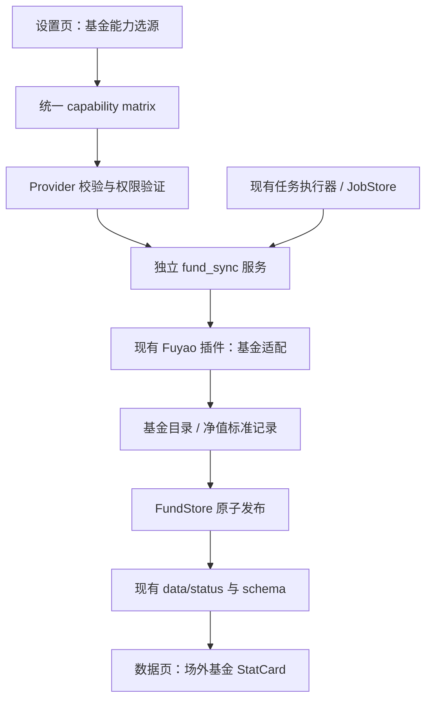

# 场外基金数据模块扩展设计（数据画像与能力接入）

> **状态：设计提案，尚未实施。** 核对日期：2026-09-20；基线：`feat/off-exchange-fund@48f5d6e5bd60ac927eafd6565358a1973afb1b3c`。
>
> 原 PR-1 的基金契约、仓库及测试已移除，当前不能复用。本方案重新定义最小数据链路，不沿用旧文档中“PR-1 已实现”或 v1/v2 迁移的前提。
>
> 遵循 [CONTRIBUTING.md](../CONTRIBUTING.md)、[secondary-development.md](secondary-development.md)，参照 [factor-system-design.md](factor-system-design.md) 的“现状映射 → 数据契约 → 接口与界面 → 缓存 → 验证 → 实施步骤”结构。文中【设计】均不是现有 API。

## 0. 目标与范围

在当前“数据”菜单的“数据画像”区域，与 ETF 同级增加“场外基金”内置卡片，形成可验证的链路：

**能力配置 → 来源验证 → 目录/净值同步 → 本地存储 → 数据画像与字段说明。**

本期只接入两个标准数据集：`fund_catalog`（场外基金目录）、`fund_nav`（历史净值）。首个生产适配为现有扶摇插件。画像表示“本地已有多少数据、覆盖什么范围、最近一次同步是否成功”。

本期不设计独立基金菜单、自选、回测、策略、交易、私募权限系统、合同账本、分红处理引擎、通用指标平台或新调度器。扶摇基本资料、持仓、分红等接口不因接口存在而全部接入。

### 0.1 可验收结果

| ID | 验收结果 |
| --- | --- |
| R1 | “页面设置”可以启用、隐藏、排序“场外基金”卡片，保留原卡片设置 |
| R2 | 设置页能力路由出现“场外基金目录”“场外基金净值”，只列真正声明能力的源 |
| R3 | 可验证来源、同步目录，选择基金代码和净值窗口后执行独立基金同步 |
| R4 | 卡片显示目录数、已有净值基金数、净值记录数、实际日期范围和同步状态 |
| R5 | 未同步也能查看目录/净值字段说明；错误、无数据、无能力明确区分 |
| R6 | 重复同步幂等，失败/取消不替换有效数据；股票与 ETF 的数据和同步逻辑保持兼容 |

“同样的方式”指复用内置卡片、设置、字段弹窗、任务基础设施与数据源能力机制；基金净值仍是独立数据类型，不转换成 ETF 日 K。

## 1. 当前代码理解【现状】

### 1.1 ETF 数据画像调用链



| 层 | 可核对位置 | 当前实际行为 |
| --- | --- | --- |
| ETF 统计 | `backend/app/api/data.py`：`_safe_aggregate_etf_instruments/daily/enriched` | 优先独立 ETF 表，部分路径兼容旧 index 存储 |
| 状态 API | 同文件 `status` | 返回 etf_instruments、etf_daily、etf_enriched；每表缓存与存储缓存分开 |
| 字段说明 | 同文件 `_SCHEMA_VIEWS`、`_TABLE_FIELD_DESC`、`table_schema` | 白名单映射；有数据时 DESCRIBE，无数据时静态说明 |
| 卡片 | `frontend/src/pages/Data.tsx`：`case 'etf'` | 复用 StatCard，展示维表/日 K/指标三个字段入口 |
| 显隐排序 | `frontend/src/components/data/PageSettingsModal.tsx` | CardKey、DATA_CARD_DEFS、localStorage；新 key 可追加旧排序；ETF 默认隐藏 |
| 卡片样式 | `frontend/src/components/data/StatCard.tsx` | 已有 loading、空态、阶段进度、来源和设置入口；部分文案依赖证券口径 |
| 字段弹窗 | `frontend/src/components/data/SchemaModal.tsx` | 统一请求 schema；标题映射和字段分类含证券特定规则 |
| 客户端缓存 | `frontend/src/lib/api.ts`、`queryKeys.ts`、`useSharedQueries.ts` | 统一 API 类型与查询键；状态轮询约 30s，活跃任务时加快 |

ETF 卡片是源码内置分支，不是已开放的插件卡片。当前二开插槽只有 navigation.extra、stock-preview.footer、watchlist.toolbar 对应的完整名称，尚无数据画像插槽。

### 1.2 能力与同步链路

| 位置 | 已有能力 | 基金接入必须处理的差异 |
| --- | --- | --- |
| `backend/app/plugins/fuyao/{client,provider}.py`、`plugin.yaml` | HTTP、密钥、股票数据集 | 当前只声明 realtime/daily/adj_factor/financial，没有基金方法 |
| `backend/app/data_providers/custom/loader.py` | 加载 Python 插件，get_provider、provider_has_dataset | 清单和实例 config.datasets 必须一致；不是只写 YAML 即可使用 |
| `backend/app/data_providers/capabilities.py` | 全局能力矩阵 | 当前每个注册项都按 tf_tier 计算 TickFlow 候选，不能直接复制一项基金配置 |
| `backend/app/services/preferences.py`、`api/settings.py` | 路由偏好、读写模型、矩阵注入 | 新字段必须同时进入读、写、getter、矩阵与前端类型 |
| `backend/app/api/pipeline.py` | 后台执行器、触发、轮询、取消 | 可复用执行设施，基金入口调用独立业务函数 |
| `backend/app/services/pipeline_jobs.py` | 全局 JobStore、执行槽、容量限制、取消 | 当前 create 无任务类别，复用活跃任务不区分资产；需最小类别标识 |
| `backend/app/jobs/daily_pipeline.py` | 股票/ETF/指数流水线 | 本方案不在该文件加入基金净值阶段 |
| `ActiveJobCard.tsx`、`SectionTitle.tsx` | 任务进度与历史行 | 当前结果显示日 K、复权、enriched 等字段；需基金结果分支 |
| `backend/app/services/fs_utils.py` | 原子 Parquet/文本写工具 | 新数据存储复用这些工具 |

### 1.3 扩展方式选择

选择“新增小型数据模块 + 必要的局部源码接线”。Provider 通过已有插件机制接入属于 L2；内置数据卡片、全局能力矩阵和任务接线属于局部 L3，必须明确管理。

不为本次两张数据表建设通用卡片注册框架，也不复制整个 Data 页面。现有扩展数据 ext-data 适合自定义表，但不能仅靠 URL/字段映射完成基金目录分页、逐基金净值拉取、独立路由与完整性验证，故不作为本期生产接入方式。

## 2. 扶摇接口与数据边界

依据 [基金总览](https://fuyao.aicubes.cn/docs/api-reference/funds/)，基金接口使用带后缀的 thscode，行情接口当前面向 ETF。场外净值应走 performance/nav，不使用 market 日线。

| 本期数据集 | 公开接口与来源 | 约束 |
| --- | --- | --- |
| fund_catalog | [标的列表](https://fuyao.aicubes.cn/docs/api-reference/ticker-list/)：GET /api/meta/tickers/list | 固定 asset_type=fund-otc；limit/offset 分页，返回量小于 limit 结束 |
| fund_nav | [基金业绩与回撤](https://fuyao.aicubes.cn/docs/api-reference/fund-performance/)：GET /api/fund/performance/nav | thscode + range + nav_type=unit,adj；窗口枚举，不能伪造日期分页 |

目录中的 fund-otc 指场外公募，基金代码后缀必须保留。基金币种字段当前统一为 CNY，应作为供应商标记保存，不据此验证所有币种份额。开放/封闭、投资分类与份额类别没有充分字段时保持未知。上述目录字段约定来自[标的列表文档](https://fuyao.aicubes.cn/docs/api-reference/ticker-list/)。

净值 range 支持 week/month/tmonth/hyear/year/twoyear/tyear/fyear；省略时最多最新一条。unit_nav 是单位净值，adj_nav 是复权净值，不能改名成累计净值。该接口未列任意 start/end 或逐条发布时间，因此只承诺实际返回的窗口覆盖。[净值文档](https://fuyao.aicubes.cn/docs/api-reference/fund-performance/)

本期不接基本资料：它虽提供公司、经理和当前资料，但不是目录分类和历史净值缺失字段的通用补全来源；单个净值也不具备可直接入历史表的净值日期证据。[基本资料文档](https://fuyao.aicubes.cn/docs/api-reference/fund-profile/)

## 3. 目标数据链路【设计】



最小新增文件建议：

| 文件【设计】 | 职责 |
| --- | --- |
| `backend/app/data_providers/fund_models.py` | 两个数据集、批次结果与错误的标准契约；字段元数据 |
| `backend/app/plugins/fuyao/funds.py` | 扶摇参数与标准字段转换 |
| `backend/app/services/fund_store.py` | 独立目录、净值、状态清单的读写与发布 |
| `backend/app/services/fund_sync.py` | 校验选源、计划、分页、合并、取消与进度 |
| `frontend/src/components/data/FundDataConfig.tsx` | 范围配置、来源验证、基金同步按钮 |

API 接线放现有 data/pipeline/settings 对应薄层；不新增 app/funds 大领域包，不恢复被删除 PR-1 的事件、条款、覆盖五模型体系。

## 4. 最小数据契约【设计】

所有记录以 `(source, symbol)` 标识来源和完整份额代码。source 为注册 Provider 名，symbol 保留 thscode 原后缀。不能按裸代码或名称自动跨源合并。

### 4.1 fund_catalog

| 字段 | 类型 | 语义 |
| --- | --- | --- |
| source | string | Provider 标识 |
| symbol | string | 完整基金代码 |
| code | string | 裸代码，仅用于展示/搜索 |
| name | string | 来源名称 |
| asset_type | literal fund_otc | 内部资产类别；不传给股票 K 线接口 |
| offering_type | literal public | 本期来源明确提供场外公募 |
| currency | string/null | 供应商声明值 |
| operation_mode | string/null | 首期为空；不能按名称猜开放/封闭 |
| investment_category | string/null | 首期为空；未知单列，不虚构类型统计 |
| source_timestamp | UTC datetime/null | 响应时间标记，不保证逐条公开时间 |
| fetched_at | UTC datetime | 本系统获取时间 |

不要求 issuer_id、share_class、valid_from，不把上市日期直接当基金成立日期。私募、LOF/ETF 场内代码不通过此目录准入。

### 4.2 fund_nav

| 字段 | 类型 | 语义 |
| --- | --- | --- |
| source / symbol | string | 与对应源的目录记录关联 |
| nav_date | date | 原毫秒时间戳按 Asia/Shanghai 转换的估值日期 |
| unit_nav | Decimal/null | 单位净值 |
| adjusted_nav | Decimal/null | 供应商复权净值 |
| source_timestamp | UTC datetime/null | 整个响应的时间标记 |
| fetched_at | UTC datetime | 获取时间 |

主键 `(source, symbol, nav_date)`。两种净值至少一项有效，null 不补 0；有效值应为有限正数。首期使用 Decimal(28,10)，解析原 JSON 时保留小数，精度超限明确报错；HTTP 输出为十进制字符串。不得全局改变原股票客户端的 float 行为。

没有累计净值字段，不计算本地收益、复权因子或 enriched。货币基金净值恒定并不等于没有收益，本期只记录返回净值，画像不评价绩效。

### 4.3 批次结果与字段定义

拟议 Provider 方法：

- `get_fund_catalog_page(limit, offset) -> FundCatalogPage`：records、has_more、source_timestamp、request_id。
- `get_fund_nav(symbol, window) -> FundNavBatch`：records、实际起止日期、source_timestamp、request_id。

空成功、网络失败、无权限、不支持、字段异常分别表达；失败不得返回空列表伪装成功。字段名、类型、说明由 fund_models 的固定元数据提供，供校验与 schema API 共用，避免文档、字段弹窗各维护一份口径。

## 5. 能力路由与扶摇插件接入【设计】

### 5.1 两项独立能力

| 能力 ID | 名称 | 偏好字段 | 默认 |
| --- | --- | --- | --- |
| fund_catalog | 场外基金目录 | fund_catalog_data_provider | fuyao |
| fund_nav | 场外基金净值 | fund_nav_data_provider | fuyao |

按现有模式修改 CAPABILITY_REGISTRY、preferences getter、settings 请求/响应与矩阵注入、ProviderField 和 RouteCapId。偏好非法时回到 fuyao 配置值；若该插件不存在或不可用，矩阵 usable=false，不自动换 TickFlow。

两项独立路由，不用“跟随目录”等特殊值。首期目录/净值同步要求二者选定同一源，因为尚无跨源身份映射；不一致时明确返回配置冲突，不暗中改偏好。更换源后旧源文件保留，画像按源隔离，不能混合净值。

### 5.2 修正 TickFlow 候选假设

当前矩阵对所有能力按 tf_tier 加入 TickFlow。建议把注册项 tf_tier 扩展为可空：基金两项设 null，表示 TickFlow 未实现；旧项保持原值。

- tf_tier=null 时 tf_available=false，TickFlow 不进 candidates。
- 前端 CapabilityRoute 类型允许 null；TickFlow 专属能力表过滤不支持项，不显示“升级套餐可解锁基金”。
- 全局路由卡仍显示基金能力及插件候选，usable 继续是门控权威。
- 旧七项能力的候选、默认值、权限判断逐项回归。
- 不用虚构最高档位或未知 tier 字符串表达“不支持”。

### 5.3 能力声明与验证

Fuyao plugin.yaml 和 provider._DATASETS 同时增加两个真实实现的数据集；新增方法及 test_dataset 分支。普通 YAML 源的字段映射能力本期不扩展。

复用 FuyaoClient 的认证、HTTP 配置和密钥管理，为基金增加保留 Decimal、request_id、原始错误码的解析路径；旧股票调用语义保持不变。当前 _get 的 data-or-empty 以及允许 code 缺失行为不能直接当作基金严格契约。

验证分两层：

1. 矩阵 usable：源已加载、密钥已配置、能力已声明；不在每次矩阵读取时发网络请求。
2. 用户“验证来源”：目录取小页，再用返回的真实场外代码请求短窗净值。记录每项验证状态、时间、样本和错误，成功但空数据标“可访问/暂无样本”。

只有 usable 且当前验证未明确失败才允许执行；尚未验证时同步入口先做同一预检。测试通过不等于全量数据保证，任务仍处理逐只错误。Key 变更使验证结果失效；不落盘 Key。基金专用 Key 若不能通过现有股票 probe，应给现有 probe 增加基金目录验证后备路径，且不得据此把股票端点标成已授权。

## 6. 独立同步、存储与发布【设计】

### 6.1 范围与入口

基金卡片的设置弹窗包含目录同步、净值代码选择、窗口和手动执行。首期先同步完整目录，再从本地目录搜索选择基金；净值范围默认为空，窗口默认 year。请求数预估依据目录分页与所选代码数显示，不自动拉全部基金历史。

基金配置保存到现有 preferences：`fund_nav_symbols`、`fund_nav_window`，与两项选源字段一起按既有原子偏好写机制更新。代码列表校验当前目录来源；窗口只允许已实现枚举。暂不做类型筛选，因为当前没有可靠分类字段。

新增 `POST /api/pipeline/fund/run`，接收明确的目录/净值操作选择，固定本次配置及源。它调用 fund_sync，不调用 daily_pipeline；原“立即同步”按钮含义保持原样，基金从自己的设置弹窗启动。本期手动同步，不新增定时任务或独立 CLI。

### 6.2 复用任务基础设施

复用现有全局 JobStore、后台执行器、run_with_capacity、任务轮询/取消入口；基金和现有数据任务串行运行，避免复制任务管理器。

最小接线：

- JobStore.create 增加可选 kind，旧调用默认 legacy；基金使用 fund_sync。持久化、_summary、前端 PipelineJob 类型传递该字段，旧记录缺字段按 legacy 读取。
- 已有其他任务时，返回其 id、kind 和 busy/reused 标记；基金页显示“数据任务占用中”，不把其他任务当基金同步成功。
- 阶段为 fund_catalog、fund_nav、fund_publish；结果包含 catalog_rows、nav_rows、nav_symbols、实际起止与 generation。
- ActiveJobCard 和 HistoryRow 按 kind 展示基金摘要，旧证券结果分支保持兼容。
- 不新建同目录 JobStore，不让第二个 CLI 进程执行恢复逻辑。首期沿用单后端任务写者部署边界。

现有 terminate 会释放执行槽，因此**执行槽本身不能保证已取消线程永不发布**。基金写入增加专属进程内运行锁（实际线程 finally 才释放），并在发布前检查取消与任务有效状态；最终提交检查和取消标记串行化，定义明确提交点。已提交结果不能被迟到取消伪装成“未写入”。这是一条必须验证的竞态，不靠延时解决。

### 6.3 最小存储

不使用股票 KlineRepository 视图。FundStore 组合 Polars 和现有 fs_utils，提供 publish/read/status，独立保存：

```text
data/fund_data/<source>/
  current.json
  snapshots/<generation>/
    catalog.parquet
    nav.parquet
    manifest.json
```

manifest 包含 schema_version=1、来源、generation、配置摘要、行数、实际日期、所选基金覆盖、抓取窗口、每只最后核验时间、任务 id 和数据文件哈希。generation 使用新唯一标识。只实现两表当前数据，不恢复五数据集、历史合同或逐条事件版本体系。

首次未执行的数据集可为固定 schema 的空表。发布以本源旧有效快照为基础合并，未选基金数据保留；无新内容不重复业务行。窗口内新值替换同键旧值，窗口外数据保留且不更新其核验时间。复权基准可能修订，优先重抓所选完整窗口，明确窗口外未重新核验，不能宣称全历史复权序列一致。

顺序：源能力预检 → 拉取/标准化 → 与旧数据合并 → 校验 → 暂存两表与清单 → 原子替换 current → 刷新画像缓存。整个任务失败或提交前取消时不切换 current。

部分基金失败则本次任务失败并保留旧快照，返回失败清单；成功空净值只更新核验状态，不删除旧净值。空目录不替换已有非空目录，首次空目录给出无数据结果。目录分页中途失败或重复页循环必须终止；短页成功结束才算目录拉取完成。

不自动删除旧数据或自动迁移旧 PR-1 遗留 data/funds。新目录不会读取这些遗留文件。快照清理不在本期自动执行范围，磁盘统计应反映实际保留体积。

## 7. 在“数据”页接入画像【设计】

### 7.1 内置卡片

PageSettingsModal 新增 `fund_otc`，名称“场外基金”，默认隐藏，与 ETF 一致；用户可启用。保留旧 localStorage 的显隐与排序，新增 key 按现有补齐规则追加。

Data.tsx 的 renderStatCard 增加该分支，复用 StatCard：

- 标题：场外基金；提示：场外公募 · 净值数据。
- 字段入口：目录、净值。
- 展示：目录基金数、已有净值基金数、净值行数、实际日期范围、最新核验状态。
- 设置入口：打开 FundDataConfig；无数据也可打开，便于首次接入。
- 缺能力时显示统一设置入口；源不可用时仍可浏览本地旧数据，并显示来源已不可用。

StatCard 不能复用 ETF 的 daily 能力键，也不能将净值日期称为“交易日”。增加可选、保持旧默认行为的统计标签/补充说明 props，或组合已有 Pill 显示基金计数；不复制整张卡片。多个数据集能力分别展示，不能把目录可用误当净值可用。

### 7.2 状态 API

现有 `GET /api/data/status` 追加可空字段 `fund_otc`：

```text
source, generation, state, error_code
catalog_rows
nav_rows, nav_symbols, nav_dates
earliest_nav_date, latest_nav_date
selected_symbols, checked_symbols, symbols_with_data
last_attempt_at, last_success_at
requested_window, coverage_note
```

尚无数据 state=not_synced；读取异常 state=error 并保留错误说明，不统一归零。其他现有状态字段仍正常返回，基金读取失败不使整页 500。

`symbols_with_data / selected_symbols` 只是选定范围的有数据比例，不是历史完整率；分母为 0 时显示“未选择”。不以股票交易日历计算基金缺口，不把最大净值日期当每只基金均已更新。画像显示实际返回覆盖，不承诺成立以来全历史。

### 7.3 字段与磁盘统计

`GET /api/data/schema/fund_catalog`、`.../fund_nav` 在原 schema 白名单中加基金分支，直接读取标准模型元数据。无需为了 DESCRIBE 向股票仓库注册基金视图。

SchemaModal 增加两个标题与最小基金字段分组；复用请求和弹窗。无数据时仍返回正确字段类型。未知表继续保持现有行为，禁止把用户表名拼接为任意路径/SQL。

data.py 的存储统计追加 fund_data 文件数和体积，只计算一次；总数包含保留快照占用，画像行数只取当前 generation。扩展 test_data_status_storage 的求和不变量。

## 8. API 与缓存清单【设计】

| 接口/类型 | 改动 |
| --- | --- |
| /api/settings/preferences | 追加两个选源字段及净值范围配置，补读写校验 |
| /api/settings/capability-matrix | 追加两项能力，支持 TickFlow 不提供某能力 |
| POST /api/settings/data-sources/test | fuyao test_dataset 支持目录/净值；FundDataConfig 复用 api.ts 中已有数据源测试请求；EndpointTestDialog 是 TickFlow 网络端点测试，不用于基金数据验证 |
| POST /api/pipeline/fund/run | 独立基金服务入口，返回 job_id/kind/reused/busy |
| /api/pipeline/jobs 与取消入口 | 复用；响应增加可选 kind，旧任务默认兼容 |
| GET /api/data/status | 追加 fund_otc |
| GET /api/data/schema/{table} | 两个基金白名单键 |
| GET /api/data/fund/catalog | 本地目录搜索分页，为范围选择提供数据；限制页大小 |

api.ts 统一维护新增请求和类型，queryKeys.ts 集中新增目录查询键；不在组件直接拼 URL。读取 API 不向供应商逐行发请求。

| 缓存 | 键/失效方式 |
| --- | --- |
| 基金本地画像 | source + generation；读取清单汇总，不每轮扫描全部净值 |
| data.py 状态/磁盘 | 扩展已有表缓存键；发布后精确失效 fund_otc 和 storage |
| 前端 dataStatus | 任务结束后失效；失败也刷新最近尝试状态，但旧有效统计保留 |
| 基金目录 | source + generation + q + page；目录发布/选源改变失效 |
| 能力矩阵/来源验证 | 设置或 Key 改变失效，不能跨密钥沿用成功结果 |
| 字段说明 | 复用 QK.tableSchema，固定 schema 与发布版本对应 |

现有 Data.tsx 的任务成功处理会刷新证券查询；需按 kind 分流，基金成功只失效基金相关键及 dataStatus/任务历史。stage 映射增加基金阶段，避免基金任务使 ETF 卡片误亮。

## 9. 改造文件、分级与风险

| 改造范围 | 分级 | 实施风险及控制 |
| --- | --- | --- |
| 新标准模型、FundStore、fund_sync | 新增模块，L2 接入主体 | 中：字段/合并/原子发布；固定样本、故障注入 |
| 扶摇基金适配 | L2 插件 + 局部源码接线 | 中：精度、响应形状；原股票 Provider 回归 |
| capabilities、preferences、settings | 局部 L3 | 中：误列 TickFlow 候选、旧偏好回退；矩阵全项回归 |
| api/data.py | 局部 L3 | 中：异常影响整页、重复计磁盘；状态隔离与统计不变量 |
| api/pipeline.py、pipeline_jobs.py | 局部 L3 | 中高：任务复用、取消/提交竞争；实际执行锁与故障测试 |
| Data.tsx、PageSettingsModal、StatCard、SchemaModal | 局部 L3 | 中：旧设置/卡片回归、交易日文案；五态与旧配置验证 |
| ActiveJobCard、SectionTitle | 局部 L3 | 低至中：结果分支兼容，旧任务缺 kind |
| api.ts、queryKeys、capability-labels、DataSources | 局部 L3 | 中：类型、路由显示、缓存串用；构建与交互验证 |
| 新 FundDataConfig | 新局部组件 | 低至中：首次无数据可操作、代码与窗口校验 |

本需求要求进入现有内置页面和全局能力矩阵，无法诚实地归类为纯 L2。控制方式是缩小每个接线点，不改 main.py、股票/ETF 仓库与 daily_pipeline，不引入新框架。

业务阻断项（与 L1/L2/L3 不同）：净值口径混用、错误源回退、取消后覆盖新数据、失败清空旧数据属于 P1；画像误计数、旧卡片设置丢失属于 P2。实施不得以“只增加一张卡片”为由跳过这些检查。

## 10. 验证矩阵与完成标准

### 10.1 自动测试

| 模块 | 必测业务断言 |
| --- | --- |
| 模型/Provider | 完整代码、只接 fund-otc；单位/复权不混；Decimal 精度、时区、null、不支持资产 |
| 目录分页 | 完整分页、最后空页/短页、重复页、途中失败；未完成目录不发布 |
| 净值窗口 | 只发供应商支持参数；默认窗口；空成功/错误区分；修订同键替换、窗口外保留 |
| 能力矩阵 | 两项基金只列声明源；所有 TickFlow 档位均不提供；旧七项结果不变 |
| 偏好与选源 | 旧配置缺字段、非法源、无 Key、源切换、两个来源不一致、未知代码 |
| Store | 幂等、schema、哈希、同代读取、写盘/指针故障旧代可读、旧 PR-1 目录不自动读取 |
| 任务 | 重复点击、其他任务占用、取消提交边界、超时旧线程恢复、重启记录、旧任务缺 kind |
| 画像/schema | 未同步、错误不归零、统计分母、无数据字段说明、未知表、磁盘体积只计一次 |
| 前端缓存 | 发布后更新、源切换、基金/证券任务失效分流、旧卡片显隐排序保留 |
| 回归 | ETF 画像/字段、股票/ETF 同步、原扶摇能力、原任务历史可用 |

已有相邻测试可核对并扩充：

- `backend/tests/test_capability_matrix.py`
- `backend/tests/test_data_status_storage.py`
- `backend/tests/test_fuyao_provider.py`、`test_fuyao_financial.py`
- `backend/tests/test_pipeline_capacity.py`、`test_pipeline_and_monitor_fixes.py`、`test_pipeline_pull_types.py`
- `backend/tests/test_atomic_parquet_writes.py`、`test_preferences_concurrent_write.py`

新增基金定向测试名称在实施 PR 中明确。先用固定脱敏响应/合成样本覆盖契约，不把真实 Key 放进 CI。

### 10.2 真实来源与页面验收

1. 使用已授权 Key 验证目录与一个真实场外代码的短窗净值，记录脱敏请求、响应、日期、字段和值；本次设计未执行该调用。
2. 同步目录与小规模净值样本；逐项核对源响应、落盘行与画像统计，再重复同步证明无重复。
3. 模拟无权限、空数据、网络失败、取消，核对旧快照与卡片状态。
4. 验证原 ETF、股票卡片、排序、字段弹窗、同步历史，覆盖加载、空、错误、无能力、成功与窄屏。
5. 执行受影响 pytest、Ruff、前端 pnpm build 和 git diff --check，报告实际结果。

性能验收只要求有证据：记录所选基金数、请求数、同步时间；画像常规轮询不得调用外网、不得全扫净值。未做实测前不承诺毫秒级指标或供应商 QPS。

## 11. 实施顺序

旧 PR 编号不表示本方案已完成。按以下四个独立变更实施：

| 阶段 | 交付 | 合入门槛 |
| --- | --- | --- |
| D1 契约与扶摇适配 | 两数据集模型、Provider 方法与样本验证 | 字段/精度/分页/错误测试，原扶摇回归 |
| D2 能力接入 | 矩阵、preferences、settings、验证入口、前端能力类型 | TickFlow 不支持分支、旧能力兼容、无权限可诊断 |
| D3 同步与本地统计 | FundStore、fund_sync、任务入口/类别、status/schema、缓存 | 原子发布/取消竞态/旧任务/统计回归 |
| D4 数据页卡片 | 卡片设置、范围选择、字段说明、任务结果展示 | 页面五态、构建、真实小样本端到端验收 |

D1 不恢复旧 PR-1。D3 的业务函数保持独立，D4 不新增基金导航。每阶段更新插件开发文档中的实际契约；未实测的来源能力必须保留验证状态，不能只凭 HTTP 200 宣称完成。

回滚时停用基金同步和卡片接线，保留 fund_data 用户数据；旧 preferences 新字段可保留但不消费。既有股票/ETF 文件不迁移、不覆盖。

## 12. 本次设计核对记录

- 当前 Git 基线及清洁工作区已核对；原基金实现已不存在。
- 已阅读贡献/二开规范，参考因子设计的数据契约、缓存、测试与分期写法。
- 已沿 ETF 卡片追踪设置、状态、字段、能力路由和任务展示的真实代码。
- 已核对扶摇公开目录与净值契约；未读取密钥、未请求鉴权业务数据。
- 本次仅改设计文档。文档验证为现状引用、方案一致性及 git diff --check；不将旧版本测试或未来测试写成此次通过。
